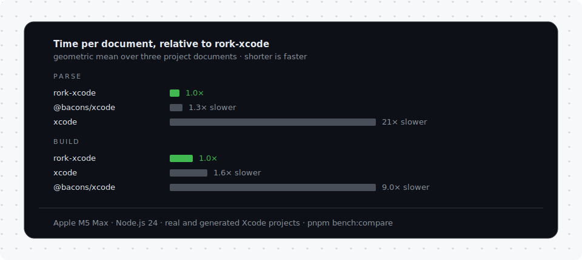

# rork-xcode

[](https://github.com/rorkai/rork-xcode/actions/workflows/ci.yml)
[](https://www.npmjs.com/package/rork-xcode)

The [fastest](#performance) zero-dependency Xcode project (`project.pbxproj`) parser and builder for any JavaScript runtime: browsers, Node.js, Bun, Electron, Cloudflare Workers, and React Native.

```ts
import { parsePbxproj, buildPbxproj } from "rork-xcode";

const project = parsePbxproj(pbxprojText);

for (const [uuid, object] of Object.entries(project.objects)) {
  if (object.isa === "PBXNativeTarget") {
    console.log(uuid, object.name, object.productType);
  }
}

const text = buildPbxproj(project); // byte-stable, Xcode-canonical layout
```

## Why

`project.pbxproj` is the heart of every Xcode project: targets, build phases, build settings, file references. Programs that create or repair Xcode projects increasingly run everywhere at once: an API on an edge runtime, a desktop app's Node process, a CLI inside a build sandbox.

`rork-xcode` is designed for exactly that situation:

- **Zero dependencies.** The pbxproj grammar is a small OpenStep-style property list dialect: dictionaries, arrays, strings, and hex data runs. A dedicated scanner covers it completely, with no general-purpose parser stack, no native addon, and no WASM blob.
- **One artifact, one code path.** A single ESM file with named exports. No environment-conditional entry points, no reliance on ambient globals like `Buffer`. What you test locally is what runs in production, whatever the bundler.
- **Xcode-canonical output.** The serializer reproduces the layout Xcode itself writes (tab indentation, per-isa object sections in sorted order, single-line build-file entries, and derived reference comments like `13B07F86… /* AppDelegate.swift in Sources */`), so diffs against Xcode-saved projects stay minimal and Xcode does not rewrite the file on next save.
- **Round-trip faithful.** Parse → build is byte-identical for Xcode-canonical documents and a fixed point for everything else. Lexical subtleties that plain number conversion would destroy (leading-zero values like `0755`, trailing-zero versions like `5.0`, digit runs longer than the double-precision safe range) are preserved as strings by design.
- **Loud failure modes.** Malformed documents fail with a typed error carrying line and column; unrepresentable values (`null`, booleans, non-finite numbers) fail with the exact path of the offending value. Nothing is silently dropped.

## Install

```sh
pnpm add rork-xcode
```

## API

### `parsePbxproj(text)`

Parses a `project.pbxproj` document into plain JavaScript values. The leading `// !$*UTF8*$!` marker and all comments are treated as trivia.

| Source shape                                           | JavaScript value |
| ------------------------------------------------------ | ---------------- |
| `{ key = value; ... }`                                 | plain object     |
| `( item, item, ... )`                                  | array            |
| unquoted number that prints back (`46`, `3.14`, `-12`) | `number`         |
| `<48656c6c6f>`                                         | `Uint8Array`     |
| everything else                                        | `string`         |

An unquoted literal becomes a number exactly when the number formats back to the identical text, so serializing can never change a scalar's bytes: leading-zero values (`0755`), trailing-zero versions (`5.0`), bare-dot decimals (`.5`), and digit runs beyond double precision all stay strings. Dictionary keys keep document order. Quoted values are always strings, so `"46"` and `46` remain distinguishable.

```ts
import { parsePbxproj, PbxprojParseError } from "rork-xcode";

try {
  const project = parsePbxproj(text);
} catch (error) {
  if (error instanceof PbxprojParseError) {
    console.error(error.message); // "Expected ';' but found '}' (line 41, column 3)"
    console.error(error.position); // { offset, line, column }
  }
}
```

### `buildPbxproj(root)`

Serializes a document back to pbxproj text. The input is the same shape `parsePbxproj` produces; any dictionary works, and documents carrying a root-level `objects` dictionary get the full Xcode layout treatment: sections grouped by `isa` and sorted, entries sorted by identifier, and reference comments derived from the object graph. Version-like build settings (`SWIFT_VERSION = 5.0`) arrive from the parser as strings and round-trip verbatim.

```ts
import { buildPbxproj, PbxprojBuildError } from "rork-xcode";

try {
  const text = buildPbxproj(project);
} catch (error) {
  if (error instanceof PbxprojBuildError) {
    console.error(error.message); // "Cannot serialize a null value… (at $.objects.AA10….name)"
    console.error(error.path); // "$.objects.AA10….name"
  }
}
```

Booleans are rejected on purpose. The format has no boolean notation (Xcode models flags as the strings `"YES"` and `"NO"`), so writing one would produce a value Xcode misreads.

## Performance

`rork-xcode` is measured against the pbxproj parsers on npm, [`@bacons/xcode`](https://www.npmjs.com/package/@bacons/xcode) (its `/json` parse/build entry point) and [`xcode`](https://www.npmjs.com/package/xcode) (the long-standing package used by native build tooling), on three documents: two real Xcode-written projects from the test suite and a deterministically generated five-target app with 800 source files. It is the fastest at both operations on every document, with zero dependencies.

<p align="center">
  
</p>

| Operation | Document                | `rork-xcode` | `@bacons/xcode`  | `xcode`          |
| --------- | ----------------------- | ------------ | ---------------- | ---------------- |
| parse     | legacy app (7 KiB)      | **13.9 µs**  | 17.8 µs (1.3×)   | 297.7 µs (21.4×) |
| parse     | app, Xcode 16 (20 KiB)  | **43.7 µs**  | 54.4 µs (1.2×)   | 795.0 µs (18.2×) |
| parse     | generated app (471 KiB) | **0.84 ms**  | 1.20 ms (1.4×)   | 19.74 ms (23.6×) |
| build     | legacy app              | **15.9 µs**  | 43.1 µs (2.7×)   | 29.6 µs (1.9×)   |
| build     | app, Xcode 16           | **37.5 µs**  | 113.6 µs (3.0×)  | 71.3 µs (1.9×)   |
| build     | generated app           | **0.98 ms**  | 85.98 ms (87.7×) | 1.20 ms (1.2×)   |

Measured on an Apple M5 Max, Node.js 24, single thread, with `@bacons/xcode` 1.0.0-alpha.33 and `xcode` 3.0.1. Multipliers are relative to `rork-xcode` on the same row; the ordering also holds on Bun. Reproduce with `pnpm bench:compare`, which interleaves the libraries in round-robin batches and reports the median, after verifying that every library round-trips every fixture.

### Key performance features

- **Single-pass scanner.** One cursor over the input string with table-driven character classification; no tokenizer stage, no intermediate token objects.
- **Comments skip in bulk.** Reference comments are a sizable share of a canonical document's bytes; comment bodies are jumped with `indexOf` instead of being scanned per character.
- **Linear comment derivation.** Building the `/* … */` annotations uses reverse indexes over the object graph (build file → phase, configuration list → owner), so serialization stays linear on projects with thousands of objects.
- **Memoized rendering.** Quoting decisions for the repeated key vocabulary and rendered uuid references are cached per document, halving the quote scans on reference-heavy sections.

## Verification

- The committed fixture corpus spans project generations from Xcode 3 to Xcode 16, captured from real projects with identifiers neutralized: synchronized folders with both exception-set kinds, classic groups, variant groups, aggregate and legacy targets, reference proxies, build rules, Swift packages, and a ~100 KiB multiplatform framework project.
- Documents already in current Xcode's layout must round-trip byte for byte; documents from other tool generations must normalize to a byte-stable fixed point with unchanged values.
- On macOS, the suite cross-validates every fixture and its rebuilt form with `plutil`, Apple's own property list parser and the empirical ground truth for what Apple tooling accepts.
- A corpus sweep (`pnpm corpus`) walks every Xcode project on the machine, verifies each one parses and reaches a byte-stable fixed point, and cross-validates a sample of parsed values against plutil's own reading.
- CI runs the full gate on Linux and macOS, and executes the built artifact on the oldest supported Node to enforce the `engines` floor.

## Releasing

Releases publish to npm from CI with [provenance](https://docs.npmjs.com/generating-provenance-statements) via [trusted publishing](https://docs.npmjs.com/trusted-publishers); no long-lived tokens are stored in the repository.

1. Bump `version` in `package.json` and merge to `main`.
2. Create a GitHub release with an `X.Y.Z` tag matching the new version.
3. The release workflow verifies the tag, runs the full gate (including
   plutil cross-validation on the macOS runner), and publishes.

## License

Apache-2.0
